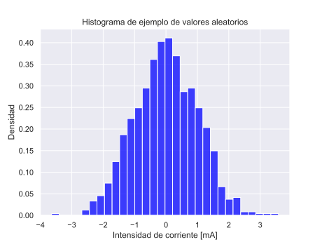

# Análisis exploratorio de datos

El análisis exploratorio de datos (EDA, *Exploratoy Data Analysis*).

## Procesamiento y análisis descriptivo con Pandas

En el `PyX` número 2 [Py2](https://github.com/fabianabarca/python) hay una amplia discusión sobre Pandas.

Aquí basta con decir que Pandas es el equivalente programático de Microsoft Office Excel y otros programas de ofimática de hojas de cálculo, como Google Spreadsheets y LibreOffice Calc.

Esto en el sentido de que Pandas manipula datos *tabulares* (filas y columnas, y en ese sentido *planos*) por medio del objeto `DataFrame`, que sería equivalente a una pestaña u hoja de Excel. Sobre los datos en este `DataFrame` es posible hacer todo tipo de operaciones y aplicar todo tipo de funciones, al igual que en Excel. 

Quizá las ventajas de Pandas son la posibilidad de trabajar con grandes cantidades de datos (limitados solamente por la memoria de la computadora) con mayor rendimiento y eficiencia. Excel tiene limitaciones de filas (1.048.576) y columnas (16.384, XFD) y su desempeño se deteriora considerablemente al aproximarse a estos límites. También Pandas permite la integración total con los múltiples paquetes de Python para crear flujos automatizados de procesamiento de datos, incluyendo aprendizaje automático e interfaces de entrada y salida (sensores, actuadores, etc.).

Además, por supuesto, Pandas es de código abierto y gratis.

## Visualización de datos con Matplotlib

En el `PyX` número 3 [Py3](https://github.com/fabianabarca/python) hay una discusión sobre los conceptos básicos de graficación con Matplotlib.

Matplotlib es popular y poderoso, pero no es la única opción de graficación en Python. Otras opciones populares y con buena documentación son:

- [Seaborn](https://seaborn.pydata.org/): basada en Matplotlib pero enfocada en gráficos estadísticos.
- [Plotly](https://plotly.com/): sintaxis amigable y disponible para varios lenguajes.

```python
import matplotlib.pyplot as plt
```


