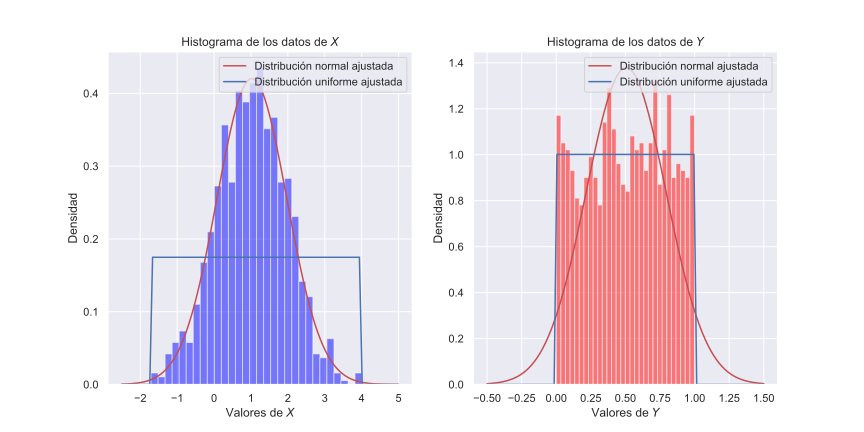

# Modelos de probabilidad de los datos

Una parte central del proyecto es modelar estadísticamente los datos con distribuciones de probabilidad.

En el `PyX` número 5 ([Py5](https://github.com/fabianabarca/python)) hay una discusión sobre modelado de datos con SciPy y Fitter.

En general, con el módulo `stats` del paquete SciPy es posible encontrar los parámetros de mejor ajuste para una distribución particular utilizando el método `fit()` de las clases de variables aleatorias. Por ejemplo, para una distribución normal:

```python title="Python"
from scipy import stats

params = stats.norm.fit(data)

print(params)
```

donde `data` es un conjunto de datos univariados. Nótese, sin embargo, que no hay ninguna garantía de que la distribución normal sea el mejor ajuste para los datos provistos, entonces es necesario hacer *pruebas de bondad de ajuste* para comparar y elegir la mejor distribución. El paquete Fitter ayuda en este trabajo.

Por ejemplo, si tenemos los siguientes dos conjuntos de datos de las variables aleatorias $X$ y $Y$, respectivamente:


Una buena intuición es asumir que la variable aleatoria $X$ tiene una distribución normal (simétrica, concentrada alrededor de un valor central y disminuyendo la densidad al alejarse) y que la variable aleatoria $Y$ tiene una distribución uniforme (densidad aproximadamente equiprobable en una región).

Podemos encontrar los parámetros de mejor ajuste para las distribuciones normal y uniforme en ambos casos que, graficados sobre el histograma son:



Aquí es posible confirmar la intuición al *observar* el ajuste de la función de densidad de probabilidad con el histograma.

Sin embargo, existen en [SciPy Stats](https://docs.scipy.org/doc/scipy/reference/stats.html) más de 80 distribuciones, entonces, ¿cuál es la verdadera distribución que mejor describe los datos? La mera observación no es suficiente. A menudo es necesario hacer [pruebas de bondad de ajuste](https://en.wikipedia.org/wiki/Goodness_of_fit).

En este sentido Fitter es un paquete auxiliar ya que, según [su documentación](https://fitter.readthedocs.io/en/latest/):

> Ahora, sin ningún conocimiento sobre la distribución o sus parámetros, ¿cuál es la distribución que mejor se ajusta a los datos? SciPy tiene 80 distribuciones y la clase Fitter las examinará todas, llamará a la función de ajuste, ignorando aquellas que fallen o se queden ejecutándose indefinidamente, y finalmente dará un resumen de las mejores distribuciones en el sentido de la suma de los errores cuadrados. Lo mejor es mostrar un ejemplo:

```python
from fitter import Fitter
f = Fitter(data)
f.fit()
f.summary()
```

!!! warning "Proceso demandante de recursos computacionales"
    `f.fit()` puede tardar muchos minutos si Fitter va a probar todas las distribuciones de SciPy Stats. Es posible indicar específicamente cuáles distribuciones deben ser evaluadas, por ejemplo:

    ```python
    f = Fitter(data, distributions=["norm", "expon", "rayleigh", "uniform"])
    ```

    o cualquier otro subconjunto de distribuciones, indicados como una lista con los nombres de las clases de SciPy Stats (disponibles con `from fitter import get_distributions; get_distributions()`).
